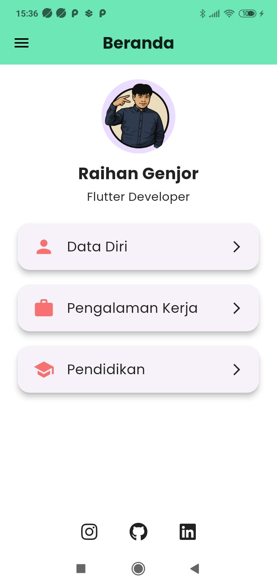
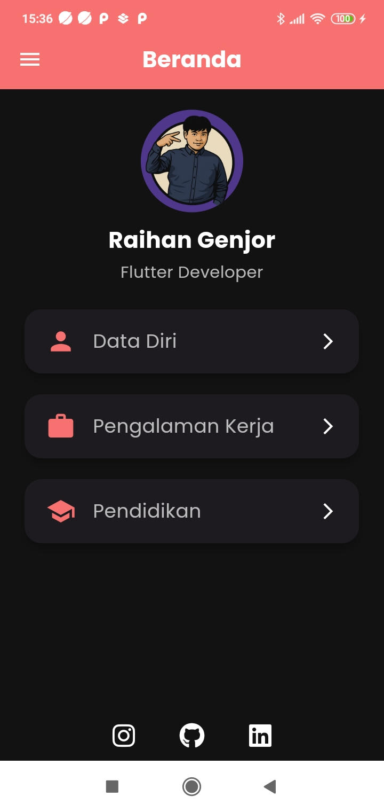

# 📱 Toto Profile Flutter App

Halo! 👋  
Ini adalah aplikasi **Profile Portfolio** sederhana menggunakan **Flutter**,  
dibuat untuk memamerkan Data Diri, Pendidikan, Pengalaman Kerja, serta terhubung ke Sosial Media seperti Instagram, Github, dan LinkedIn.

---

## ✨ Fitur Utama

- 🌗 **Dark Mode & Light Mode** (switch theme dengan animasi smooth)
- 🚀 **Loading Animation** saat navigasi antar halaman
- 📄 **Animated Cards** untuk menu navigasi utama
- 🎨 **Full Responsive** untuk HP berbagai ukuran
- 📚 **Expandable Cards** untuk detail Pendidikan dan Project
- 📷 **FullScreen Image View** untuk gambar project
- 🌎 **Sosial Media Buttons** (Instagram, Github, LinkedIn)
- ⚡ **Custom Page Transition** untuk animasi perpindahan halaman

---

## 🛠️ Teknologi & Package yang Digunakan

- **Flutter 3.6+**
- `provider` ➔ State Management untuk Theme
- `font_awesome_flutter` ➔ Icon Sosial Media
- `loading_animation_widget` ➔ Animasi Loading
- `google_fonts` ➔ Custom Font (Poppins)
- `url_launcher` ➔ Membuka link ke sosial media

---

## 📸 Screenshot

| Light Mode | Dark Mode |
|------------|-----------|
|  |  |

---

## 🚀 Cara Menjalankan Project

1. Clone repository ini
    ```bash
    git clone https://github.com/username/toto_profile_flutter.git
    ```
2. Masuk ke direktori project
    ```bash
    cd toto_profile_flutter
    ```
3. Install dependencies
    ```bash
    flutter pub get
    ```
4. Jalankan aplikasi
    ```bash
    flutter run
    ```

---

## 🙌 Kontributor

- **Muhamad Surya Al Ghifari** (Developer)

---

## 📬 Kontak Saya


---

## ⭐ Kalau suka project ini, kasih Star ya!
Makasih banyak supportnya! 🚀

---
